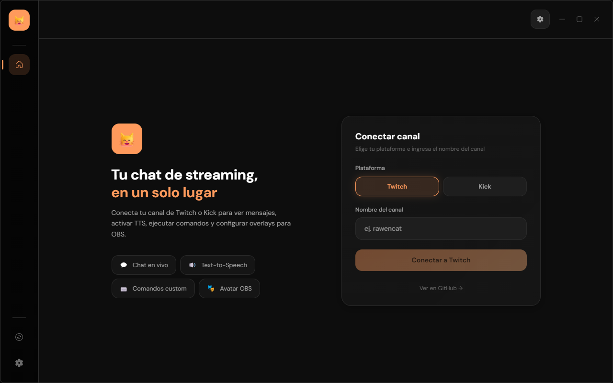
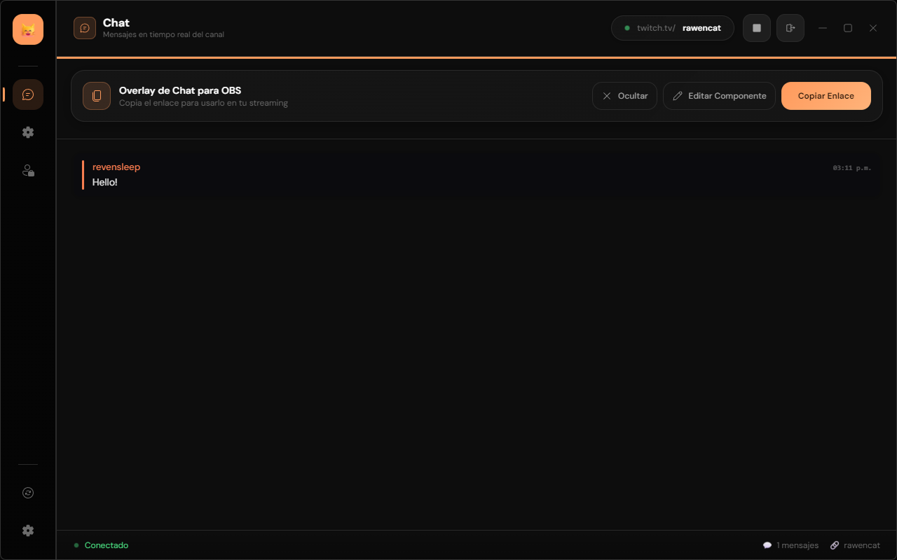
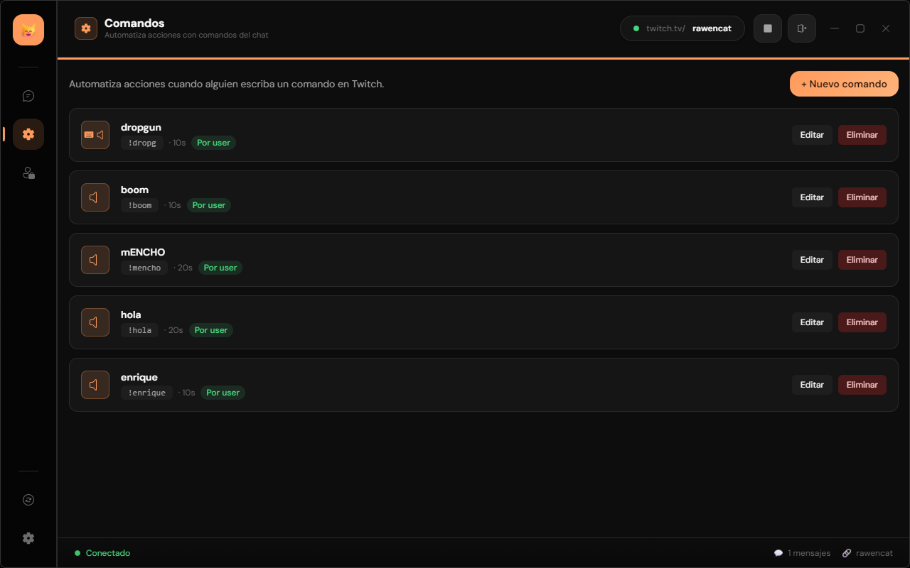
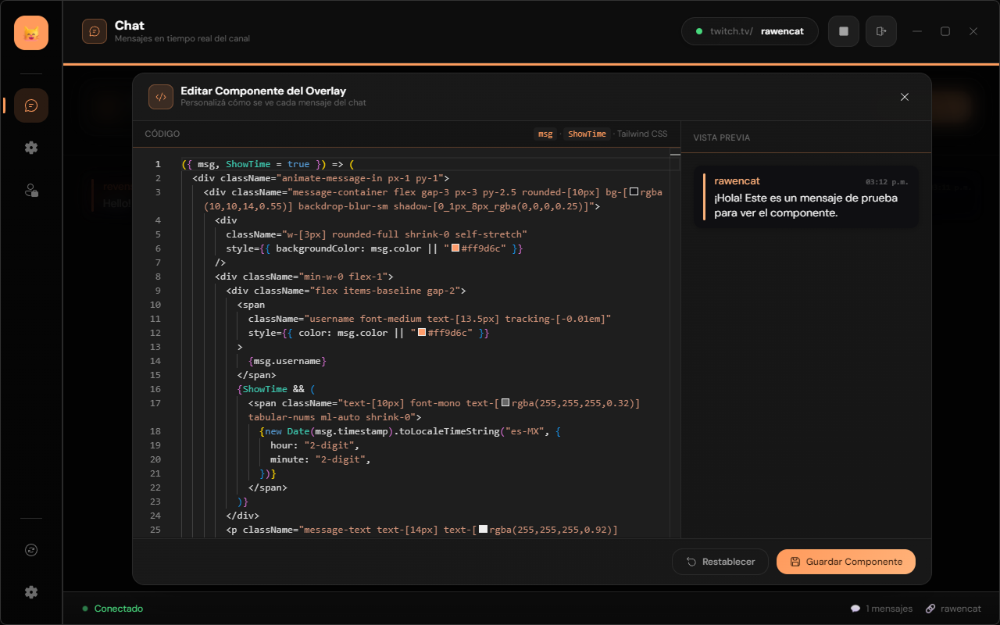
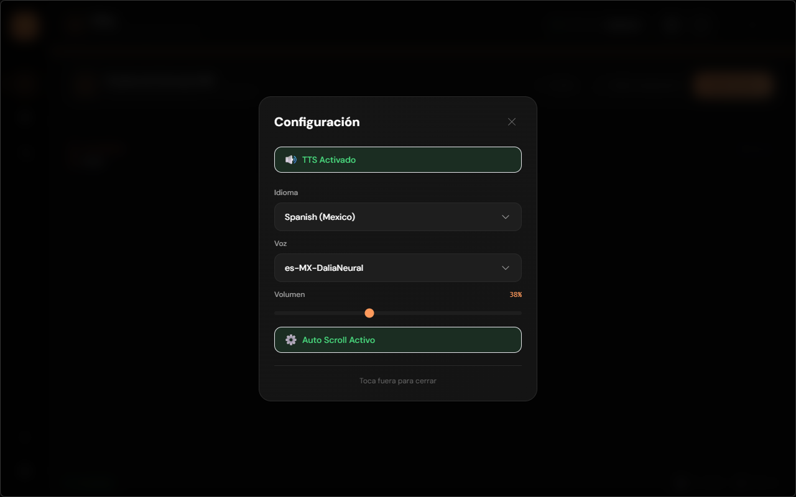
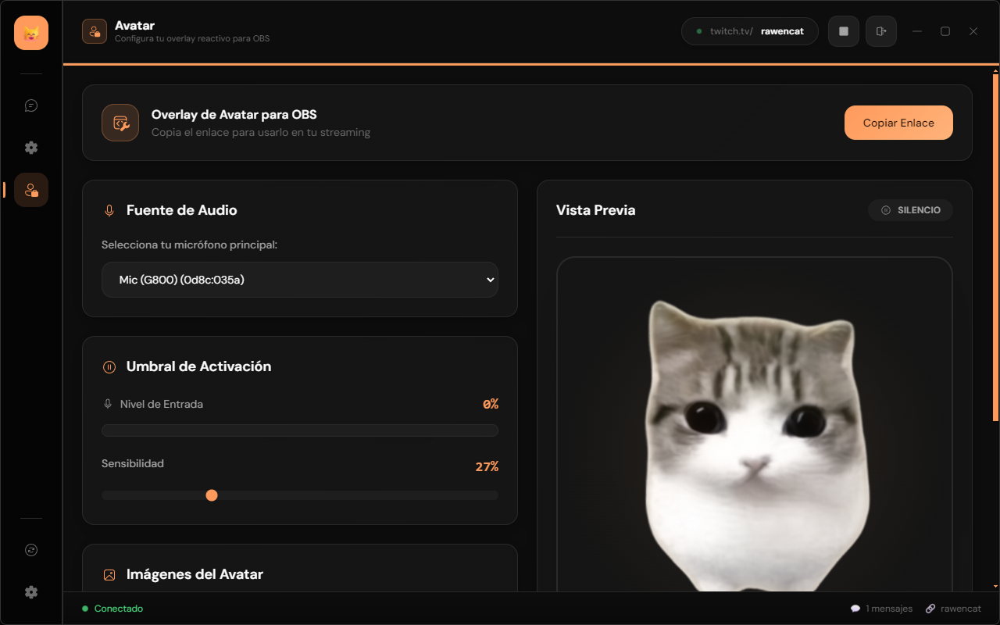
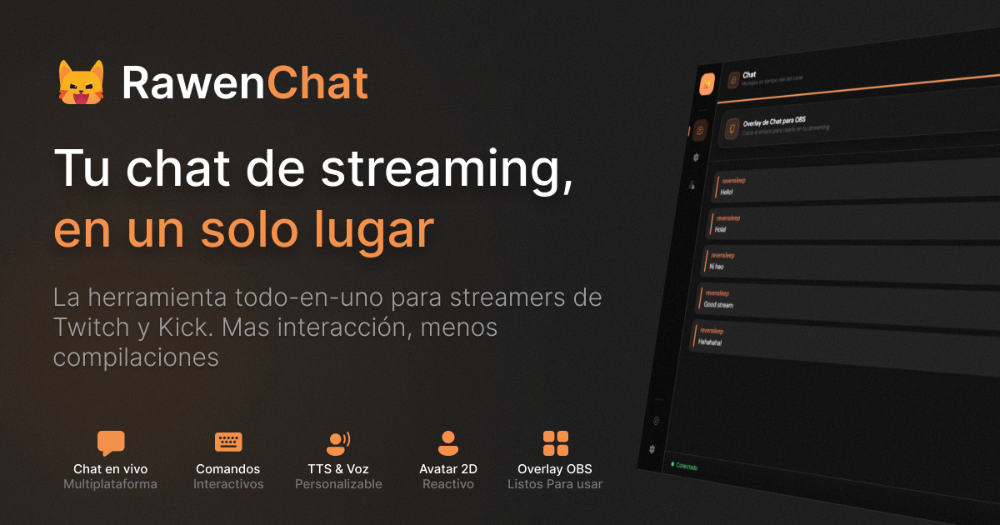
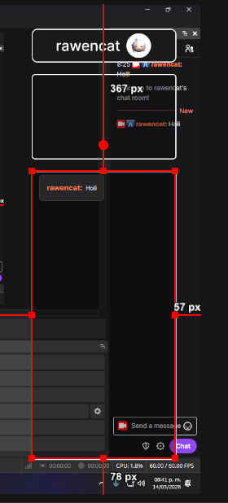

<div align="center">


# 🐱 RawenChat

**La app definitiva para streamers de Twitch y Kick**

[](https://github.com/RevenzMind/RawenChat/releases/latest)
[](https://www.twitch.tv)
[](https://kick.com)

---

Lee el chat de tu canal en tiempo real, ejecuta comandos, reproduce sonidos, activa teclas y usa overlays personalizados para OBS.

</div>

---

## 🐾 Showcase

<div align="center">

### Pantalla de inicio


### Chat en vivo


### Editor de comandos


### Edición de código


### Configuración


### Avatar Overlay


### Embed personalizado


</div>

---

## ⚡ Funcionalidades

| Feature | Descripción |
|---------|-------------|
| 🗣️ **TTS** | Lee los mensajes del chat en voz alta con Microsoft Edge TTS |
| ⌨️ **Comandos** | Crea comandos que reproducen sonidos, activan teclas o responden texto |
| 🎭 **Avatar Overlay** | Overlay reactivo al micrófono para tu avatar en OBS |
| 💬 **Chat Overlay** | Overlay de chat personalizable con código React en tiempo real |
| 🔄 **Auto Scroll** | El chat se desplaza automáticamente para seguir los mensajes |
| ⏱️ **Rate Limiting** | Timeouts por comando y por usuario para evitar abusos |
| 🌐 **Multiplataforma** | Twitch (tmi.js) y Kick (WebSocket) soportados |
| 🖥️ **Electron** | App de escritorio multiplataforma (Windows, Mac, Linux) |

---

## 🐱 Overlays para OBS

### Chat Overlay

1. Abre la app y conecta tu canal
2. Haz clic en **"Copiar URL del Overlay"**
3. En OBS, agrega una fuente **"Browser"** y pega la URL
4. Personaliza el componente del overlay con el editor de código integrado (React + Tailwind)



### Avatar Overlay

1. Ve a la pestaña **Avatar** en la app
2. Configura tu micrófono, imágenes idle/active y sensibilidad
3. Haz clic en **"Copiar URL"** y pégala como fuente Browser en OBS
4. Tu avatar reaccionará en tiempo real a tu voz

---

## 🚀 Inicio rápido

### App de escritorio

1. Descarga la última versión desde [Releases](https://github.com/RevenzMind/RawenChat/releases/latest)
2. Instala y ejecuta
3. Elige tu plataforma (Twitch/Kick), escribe tu usuario y conecta

### Desarrollo

```bash
git clone https://github.com/RevenzMind/RawenChat.git
cd RawenChat
pnpm install
pnpm dev
```

Abre `http://localhost:3000`

---

## 🐱 Ejemplos de comandos

```
!hola      → responde con texto
!sonido    → reproduce un sonido
!alerta    → muestra una alerta visual
!escena    → simula una tecla / cambia de escena en OBS
```

---

## 🛠️ Tech Stack

<div align="center">


</div>

---

## 📦 Estructura del proyecto

```
RawenChat/
├── electron/          # Electron main process (TypeScript)
├── src/               # Next.js frontend (React 19 + Tailwind)
│   ├── app/
│   │   ├── page.tsx        # App principal
│   │   ├── obs/page.tsx    # Overlay de chat para OBS
│   │   └── avatar/page.tsx # Overlay de avatar para OBS
│   ├── components/    # UI components
│   ├── hooks/         # Custom hooks (TTS, Avatar, Chat)
│   └── utils/         # Utility functions
├── public/            # Static assets
│   └── showcase/      # Screenshots para el README
├── scripts/           # Release & deploy scripts
└── server.js          # WebSocket bridge (dev mode)
```

---

<div align="center">

**Hecho con 🐱 por [RawenCat](https://chat.rawencat.tech)**

</div>
