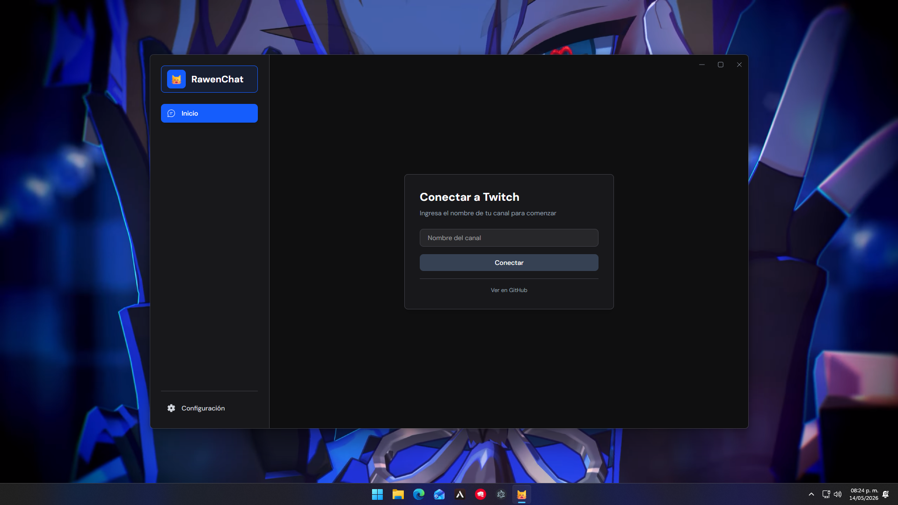
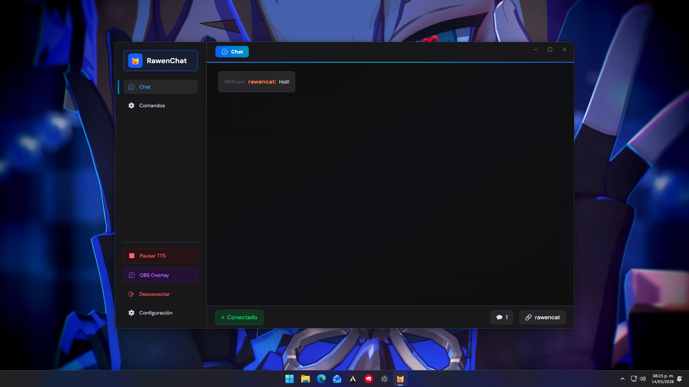
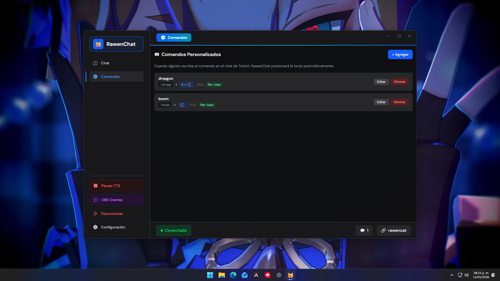
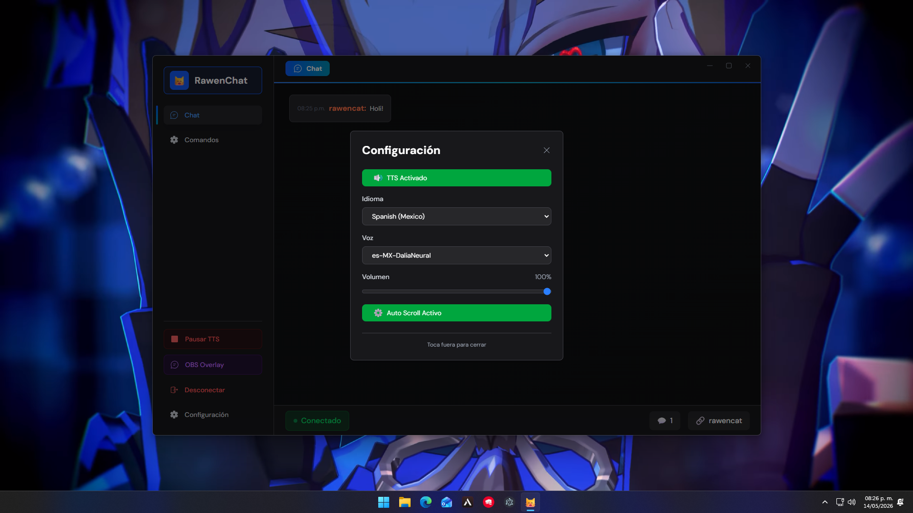

# RawenChat

App ligera para leer el chat de tu canal de Twitch o Kick y ejecutar comandos desde el chat.

[](https://github.com/RevenzMind/RawenChat/releases/latest)

## Resumen rápido

- Elige plataforma (Twitch/Kick), entra tu usuario y conecta.
- Verás el chat en tiempo real.
- Usa comandos para reproducir sonidos, activar teclas o acciones.

## Flujo (visual)

1. Inicio — escribe tu usuario y conecta.

   

2. Chat — mensajes en vivo con TTS opcional.

   

3. Comandos — reproducir sonidos, alertas o pulsar teclas.

   
   

## Funcionalidades principales

- `TTS` para leer mensajes.
- `Auto scroll` para seguir el chat.
- Comandos personalizables (texto, sonido, tecla, timeout).
- Timeouts por comando para evitar abusos.

### Ejemplos de comandos

```txt
!hola     -> responde texto
!sonido   -> reproduce un sonido
!alerta   -> muestra una alerta
!escena   -> activa una tecla / cambia escena
```

## OBS (overlay)

Pulsa **OBS overlay** en la app para copiar la URL que genera, pégala en una fuente "Browser"/"Navegador" en OBS y ajusta tamaño/posición. Listo.


## Desarrollo

Instala y ejecuta:

```bash
pnpm install
pnpm dev
```

Abre:

```txt
http://localhost:3000
```

## Tech

- Next.js
- React
- TypeScript
- Tailwind CSS
- tmi.js + WebSocket (Kick)
- edge-tts-universal